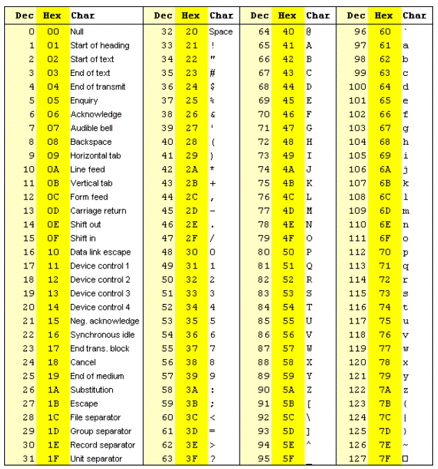

# 03 JavaScript: Password Generator

## User Story

```
AS AN employee with access to sensitive data
I WANT to randomly generate a password that meets certain criteria
SO THAT I can create a strong password that provides greater security
```

## Acceptance Criteria


- [x] GIVEN I need a new, secure password
- [x] WHEN I click the button to generate a password
- [x] THEN I am presented with a series of prompts for password criteria
- [x] WHEN prompted for password criteria
- [x] THEN I select which criteria to include in the password
- [x] WHEN prompted for the length of the password
- [x] THEN I choose a length of at least 8 characters and no more than 128 characters
- [x] WHEN prompted for character types to include in the password
- [x] THEN I choose lowercase, uppercase, numeric, and/or special characters
- [x] WHEN I answer each prompt
- [x] THEN my input should be validated and at least one character type should be selected
- [x] WHEN all prompts are answered
- [x] THEN a password is generated that matches the selected criteria
- [x] WHEN the password is generated
- [x] THEN the password is either displayed in an alert or written to the page

## JavaScript takeaways 

* I used math.floor & math.random to select specific numbers and letters from the method fromCharCode



* Used Const with all special characters defined "!@#$%^&*(){}[]=<>/.,"

